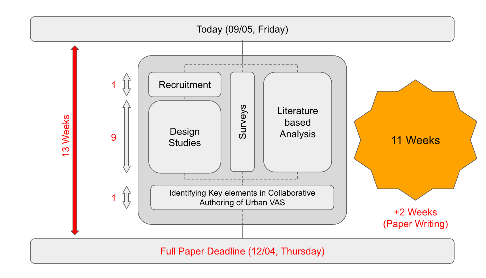

# CANVAS-KG
Visualization framework for capturing Collaborative Authoring in Urban Visual Analytics Systems

## Clone the repository with submodules
```
git clone https://github.com/Vamsi-Dath/CANVAS-KG.git
cd CANVAS-KG
git submodule update --init --recursive --remote
```

## Install Dependencies
```
pip install -r requirements.txt
```

## spaCy for Entity name shortening
```
pip install spacy
python -m spacy download en_core_web_md
```

## Usage Instructions
```
python run.py \
    --input_text_file_path ./data/input/{dataset}.txt \
    --output_dir ./data/output/{dataset} \
    --output_file_name output.csv \
    --entity_bank_json_path ./data/Entity_Bank.json \
    --system_prompt_template_path ./prompts/system_prompt_template.txt \
    --openai_model gpt-4
```

## Development Timeline



## Methodology

.webp)